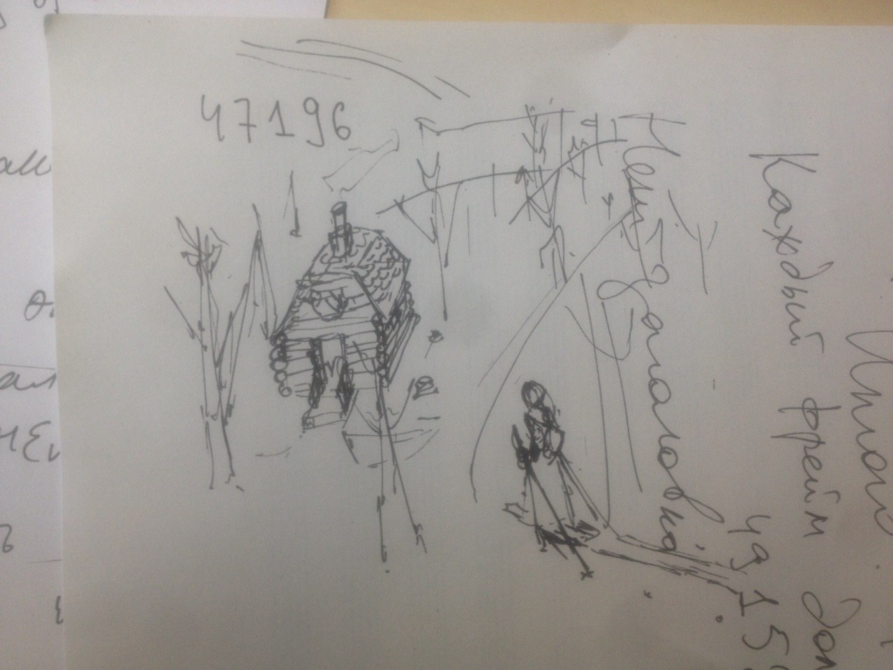

# 11 июля 2017
## Самые сильные сцены из Пер Гюнта Ибсена
Заметка для себя, интересно потом сравнить, как изменится моё мнение.

Читал я Пера Гюнта году в 2008 летом (я тогда вообще очень много мирового
худлита перечёл, до сих пор не могу побить рекорд), как раз перед своей
отправкой в физматшколу в Новосибирск. И не скажу, что что-нибудь вообще в
голове после этого осталось. Очень скучно и уныло. Я тогда больше фанател по
саге о Форсайтах или по Бернарду Шоу. А тут вот послушал передачу Быкова и
триггернулся перечитывать Ибсена. Так вот.

Для этой книги надо повзрослеть, хотя бы в 20 лет её читать. Тогда сцена "утро
после похищения невесты", например, непроизвольно заставляет смеяться. Как тут
говорят в этих наших интернетах, орнул в голосину: так точно эта сцена сделана.
Или вот жених не может открыть дверь в комнату, где заперлась невеста. Или вот
разговор с тролльским королём: всплывает в голове сюжет Гётевского Фауста (хотя
мне тут надо признаться, что я и в переводе не читал, всё лелею надежду выучить
немецкий язык). От этого пьесу гораздо интереснее читать, вообще интересно
читать ровно то что понимаешь, что с душой резонирует. Теперь перейдём к
сильным сценам, ну а точнее к тому, что более всего захватило меня.

### Сцена смерти матери
Не буду комментировать много -- тяжело это.
Хоть Осе мне и не нравилась, её саму очень жалко. Ибсен играет на контрасте.
Смешная наполовину сошедшая с ума старуха умирает. Не будет больше ворчать она.
И причитать не будет. И это переворачивает жизнь Пера. Смерть матери выгоняет
его из Норвегии (и тут мне становится очень страшно, потому что именно смерть
моей бабушки совпала с моим отъездом из родной страны).

### Сольвейг приезжает к изгнанному Перу 
Когда знаешь, чем всё закончится, сцена производит очень сильное впечатление.
Сольвейг отрекается от родителей и от сестры ради болтуна, которого она почти не
знает (только разве что со слов Осе). Который, уйдя за дровами, возвращается
только через пятьдесят лет. А ещё она приезжает на лыжах с узелком за спиной и в
платочке. Пытался загуглить эту картинку -- должна же быть такая иллюстрация. Не
нашёл. Нарисовал  на клочке бумаги, что поделать-то.

### Возвращение Пера
Быков вообще считает эту сцену самой лучшей, написанной в XIX веке...
Я пролистал четвёртую и пятые главы: мысли не могут сосредоточится на
путешествиях Пера. Вот его корабль терпит крушение у берегов родной Норвегии.
Вот за ним приходит смерть. И вот он находит слепую Сольвейг в своём доме. И
падает ей в колени. В этот момент душу выворачивает. Не буду ничего здесь
писать.

## Комментарии, выводы
Ибсен начинает всю пьесу как комедию. А потом с каждым шагом действие всё мрачнеет
и мрачнеет. Именно на контрасте смысл вычерчивается гораздо лучше -- хороший, но
сейчас уже немного пошлый художественный приём (привет играм 90-х со
скриммерами). Остаётся только понять, в чём смысл. Я пока соберу лишь часть
урожая, не копая глубоко. Мне нужны практические выводы.
* Моя  жизнь  похожа на жизнь Пера Гюнта.
* Сольвейг совершает подвиг, при этом не бессмысленно: как минимум она
показывает пример (кому?)
* Христианское прощение -- чего же тут комментировать
* Хочу сделать иллюстрации к этим вот трём сценам, одну даже уже начеркал
Пока выводов больше не делаю.
